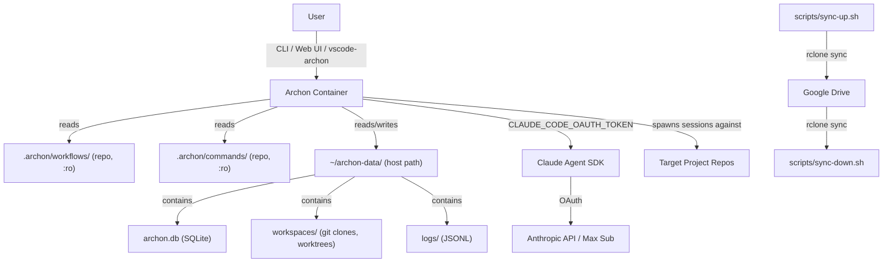

# Architecture

## System Overview

archon-setup is a wrapper repository that provides Docker-based deployment and management of Archon, an open-source harness builder (TypeScript/Bun). The repo contains no application code — only configuration, custom workflow definitions, operational scripts, and documentation. Archon runs as a pre-built container pulled from GHCR, with all persistent state stored on the host filesystem for portability and inspectability.

## Component Descriptions

### `app` Container (`archon-app`)

The Archon monolith, running as `ghcr.io/coleam00/archon:{tag}`. Built on Bun + React, it exposes port 3000 on localhost only. The container reads custom workflow and command files from read-only volume mounts sourced from the wrapper repo. It writes all persistent data (SQLite database, workspace clones, worktrees, artifacts, logs) to the host-path volume at `~/archon-data/`. The container is stateless in the sense that replacing it loses no data — everything meaningful is on the host.

### Host-Path Volume (`~/archon-data/`)

A regular directory on the host filesystem mapped to `/.archon` inside the container. Contains the SQLite database (`archon.db`), workspace git clones and worktrees, build artifacts, and JSONL logs. This directory survives container replacement, can be inspected with standard tools (`ls`, `sqlite3`), backed up with `cp`, and synced across machines with `rclone`. It is the portable unit of Archon state.

### Repo Volume Mounts

`.archon/workflows/` and `.archon/commands/` from the wrapper repo are mounted into the container as read-write volumes. These contain custom Archon workflow YAML files and command Markdown files. Same-name files override Archon defaults. The read-write mount allows Archon's workflow builder UI to write new workflow definitions directly to the host filesystem, where they can be committed and pushed via git. The team shares workflows bidirectionally: receiving via `git pull` + restart, creating via the UI + `git commit` + `git push`. Configuration (`.archon/config.yaml`) is mounted read-only (`:ro`) since Archon should not modify its own config at runtime.

### Scripts (`scripts/`)

Bash scripts that run on the host (not inside the container) for operational tasks: OAuth token setup, cross-machine data sync via rclone, version upgrades with backup safety, database backups, and health checks. All scripts are idempotent, narrate their actions, check for required tools at startup, and exit non-zero with human-readable messages on failure.

## Data Flow

User invokes a workflow via CLI, Web UI, or the vscode-archon extension (which reads workflow YAML directly). Archon reads the workflow YAML from the repo volume mount and spawns a Claude Agent SDK session with the configured model, tools, and prompt. The SDK authenticates via the OAuth token from `.env` (sourced as `CLAUDE_CODE_OAUTH_TOKEN`). Claude processes the request against the target project repository. Results are stored in SQLite at `~/archon-data/archon.db`. Workflow execution logs are written to `~/archon-data/workspaces/`. Output is available in the Web UI at `localhost:3000` and via the CLI.

For cross-machine sync: `scripts/sync-up.sh` stops Archon (`docker compose down`), syncs `~/archon-data/` to a configurable rclone remote (Google Drive by default), then optionally restarts. On the destination machine, `scripts/sync-down.sh` stops Archon, syncs from the remote to `~/archon-data/`, and restarts.

## External Dependencies

- **GHCR** (`ghcr.io/coleam00/archon`) — Pre-built Docker images for Archon, pulled on `docker compose pull`. Required for initial setup and version upgrades.
- **Anthropic API** — Accessed via the Claude Agent SDK within the Archon container, authenticated by the OAuth token from `.env`. Required for all workflow execution.
- **GitHub API** — Via `gh` CLI for workflows that manage issues and PRs. Optional — only needed for GitHub-integrated workflows.
- **Google Drive / rclone remote** — For cross-machine data sync. Optional — only needed if syncing between machines.

## Infrastructure & Deployment Model

Local-only deployment. Each developer runs their own Archon instance on their machine via Docker Compose. There is no cloud infrastructure, no CI/CD pipeline for the app itself (only for validating the wrapper repo), and no shared environments.

- **Container:** `archon-app` running `ghcr.io/coleam00/archon:{tag}` on `127.0.0.1:3000`
- **Network:** `archon-network` (Docker bridge)
- **Host-path volume:** `~/archon-data` mapped to `/.archon` in the container
- **Optional:** `archon-postgres` container with `archon_postgres_data` named volume (only with `--profile with-db`)
- **DNS:** `8.8.8.8, 8.8.4.4` on the app container (required for external API calls from within the container)
- **Restart policy:** `unless-stopped` on all containers

See `.claude/docs/deployment.md` for operational procedures.

## Security Architecture

- **Authentication:** OAuth token stored in `.env` file, which is `.gitignore`'d and never committed. Token generated via `claude setup-token` on the host. Authenticates against Anthropic API using the developer's Max subscription.
- **Network exposure:** Archon Web UI and API bound to `127.0.0.1:3000` only — no external port exposure. No authentication on the UI, which is acceptable for a single-user local installation.
- **Volume mounts:** Custom workflow and command directories mounted read-write so Archon's builder UI can create new definitions. Configuration mounted read-only (`:ro`). The git repo is the source of truth — UI-created workflows must be committed to persist across clones.
- **Host filesystem:** `~/archon-data/` is user-owned on the host. Standard filesystem permissions apply. No special encryption at rest beyond OS-level disk encryption.
- **Secrets management:** `.env` is the only secrets file. `.env.example` provides the template without values. No secrets in Docker Compose, Dockerfiles, or workflow YAML files.
