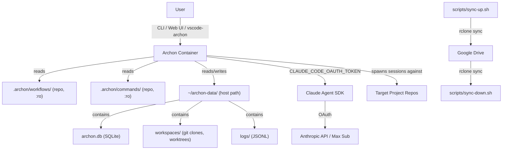

# Project Seed


## Project Identity

### Name
archon-setup

### Description
Wrapper repository for a version-pinned local Archon installation with custom workflows, OAuth authentication, portable data via host-path volumes, and team-friendly documentation for developers with minimal Docker experience.

### Team

| Role | GitHub Handle |
|------|---------------|
| Lead | @Thummpy |


## Project Thesis

### Problem Statement
Archon is a rapidly evolving open-source harness builder (TypeScript/Bun) that publishes Docker images to GHCR. Installing Archon from source requires Bun, Node.js, and OS-specific dependency resolution — a process that has taken team members a full day. Additionally, there is no separation between upstream code and local customizations, no version pinning, and no mechanism to share custom workflows across a team. A wrapper repo is needed to provide one-command Docker-based setup, pin a specific version, own custom workflows/commands in version control, and enable portable data across machines.

### Goals
- One-command setup for any developer with Docker installed: `cp .env.example .env`, paste OAuth token, `docker compose up -d`
- Pin Archon to a specific GHCR image tag (`ghcr.io/coleam00/archon:vX.Y.Z`), upgrade deliberately by bumping the tag
- Own custom workflows and commands in version control, volume-mounted into the container read-only
- Host-path volume for Archon's data directory (`~/archon-data/`) so personal state (SQLite DB, workspaces, logs) is a regular folder — inspectable, syncable, and survives container replacement
- Cross-machine portability via rclone sync to Google Drive (or any rclone remote)
- Clear, beginner-friendly documentation covering setup, daily use, workflow sharing, data sync, and upgrades
- Authenticate via OAuth (`CLAUDE_CODE_OAUTH_TOKEN`) using the developer's Max subscription

### Target Users
Chris (Atyeti CDO/CAIO) as primary. Atyeti developers who may have minimal Docker experience and need a turnkey setup.

### Major Features

1. **Version-pinned Docker Compose** — `docker-compose.yml` referencing `ghcr.io/coleam00/archon:{tag}` with `image:` (not `build:`). SQLite as default database (zero config). Host-path volume at `~/archon-data/` for portable data.
2. **Custom workflows and commands** — `.archon/workflows/` and `.archon/commands/` directories in the repo, volume-mounted into the container as read-only overlays. Same-name files override Archon defaults. Team shares via `git pull`.
3. **OAuth setup helper** — `scripts/setup-oauth.sh` installs Claude CLI if needed, runs `claude setup-token`, writes token to `.env`.
4. **Cross-machine sync** — `scripts/sync-up.sh` and `scripts/sync-down.sh` stop Archon, sync `~/archon-data/` via rclone to a configurable remote (Google Drive default), restart Archon.
5. **Upgrade tooling** — `scripts/upgrade.sh` backs up `~/archon-data/archon.db`, bumps image tag, pulls new image, restarts, validates health.
6. **Beginner-friendly docs** — `docs/SETUP.md` (step-by-step with screenshots-level detail), `docs/DAILY-USE.md` (running workflows, checking status), `docs/SHARING-WORKFLOWS.md` (git pull, restart), `docs/SYNC-BETWEEN-MACHINES.md` (rclone setup, sync scripts), `docs/UPGRADING.md` (version bumps), `docs/TROUBLESHOOTING.md` (common errors).
7. **Optional PostgreSQL profile** — `docker compose --profile with-db up -d` for users who need durable multi-user state. Not default. Not required.

### Subsystems

- **compose** — Docker Compose configuration, service definitions, profiles, volume mounts, network config
- **workflows** — Custom Archon workflow YAML files and command Markdown files. These ARE the harness definitions consumed by both Archon and the vscode-archon extension.
- **scripts** — Shell scripts for OAuth setup, data sync, upgrades, health checks, backup
- **docs** — Step-by-step guides written for developers with minimal Docker/DevOps experience

### Initial Roadmap

- **Phase 1: Vertical slice** — Docker Compose with pinned Archon image, SQLite, host-path volume, OAuth setup script, one custom workflow (atyeti-pev), SETUP.md, health check. Goal: a new developer clones, runs 4 commands, has a working Archon with the PEV workflow.
- **Phase 2: Sync and portability** — rclone setup, sync-up/sync-down scripts, SYNC-BETWEEN-MACHINES.md. Goal: Chris can work on laptop, sync to Drive, pick up on desktop.
- **Phase 3: Team workflow library** — Build out custom workflows for Atyeti's standard modalities (ML pipeline, data ingestion, web app, document editing, infra). SHARING-WORKFLOWS.md. DAILY-USE.md.
- **Phase 4: Operational hardening** — Upgrade script with backup, schema safety checks, UPGRADING.md, TROUBLESHOOTING.md. Optional Postgres profile for anyone who needs it.

### Out of Scope
- Modifying Archon's source code or forking the repo
- Cloud deployment (GCP, AWS, etc.) — local Docker only. Cloud is a future decision.
- Building the vscode-archon extension (separate project, separate seed)
- Multi-user authentication or team access controls on the Archon instance
- Archon Web UI customization
- Custom Docker image builds — we consume the upstream GHCR image as-is


## Tech Stack

### Language
Bash (scripts), YAML (Docker Compose, workflow definitions), Markdown (command files, documentation)

### Framework
Docker Compose v2 (container orchestration)

### Database
SQLite (Archon's default, zero config, stored at `~/archon-data/archon.db`)

### Infrastructure
Docker, Docker Compose. Local-only.

### Additional Tools
- `claude` CLI — host-side, for one-time OAuth token generation via `claude setup-token`
- `rclone` — for cross-machine data sync to Google Drive or other remotes
- `gh` CLI (optional) — for workflows that interact with GitHub issues/PRs
- `jq` (optional) — JSON processing in operational scripts


## Architecture

### Overview
Wrapper repo pattern. The repo contains no application code — only configuration, custom workflows, operational scripts, and documentation. Archon runs as a pre-built Docker image pulled from GHCR. All persistent state lives in `~/archon-data/` on the host filesystem, making it inspectable, syncable, and independent of the container lifecycle.

### Components

- **`app` container** — `ghcr.io/coleam00/archon:{tag}`. Archon monolith (Bun + React). Exposes port 3000 on localhost. Reads custom workflows/commands from repo volume mounts. Writes data to host-path volume.
- **Host-path volume (`~/archon-data/`)** — Regular directory on the host mapped to `/.archon` inside the container. Contains SQLite database, workspace clones, worktrees, artifacts, logs. Survives container replacement. Syncable via rclone.
- **Repo volume mounts (read-only)** — `.archon/workflows/` and `.archon/commands/` from the wrapper repo mounted into the container. Updated via `git pull` + container restart.
- **Scripts** — Bash scripts for setup, sync, upgrade, and health checks. Run on the host, not inside the container.

### Data Flow
User invokes workflow (CLI, Web UI, or vscode-archon extension reads YAML) → Archon reads workflow YAML from repo volume mount → spawns Claude Agent SDK session with configured model/tools/prompt → SDK authenticates via OAuth token from `.env` → Claude processes request against target project → results stored in SQLite at `~/archon-data/archon.db` → workflow logs written to `~/archon-data/workspaces/` → output available in Web UI and CLI.

### Diagram



### External Dependencies
- **GHCR** (`ghcr.io/coleam00/archon`) — pre-built Docker images, pulled on `docker compose pull`
- **Anthropic API** — via Claude Agent SDK within the Archon container, authenticated by OAuth token
- **GitHub API** — via `gh` CLI for workflows that manage issues/PRs (optional)
- **Google Drive / rclone remote** — for cross-machine data sync (optional)

### Security Model
- OAuth token stored in `.env` file (`.gitignore`'d). Never committed.
- Archon Web UI and API at `localhost:3000` only — no external port exposure. No authentication on the UI (acceptable for single-user local install).
- Custom workflow/command files mounted read-only (`:ro`) — the container cannot modify the harness definitions.
- `~/archon-data/` is user-owned on the host filesystem. Standard filesystem permissions apply.


## Project Structure

```
archon-setup/
├── docker-compose.yml          # Pinned Archon image, host-path volume, optional Postgres profile
├── .env.example                # Template: CLAUDE_CODE_OAUTH_TOKEN, PORT, RCLONE_REMOTE
├── .archon/
│   ├── config.yaml             # Archon configuration overrides
│   ├── workflows/              # Custom workflow YAML files (shared via git)
│   │   ├── atyeti-pev.yaml     # Standard Plan-Execute-Validate workflow
│   │   └── ...
│   └── commands/               # Custom command Markdown files (shared via git)
│       ├── plan.md
│       ├── execute.md
│       ├── review.md
│       └── ...
├── scripts/
│   ├── setup-oauth.sh          # Install claude CLI if needed, run setup-token, write to .env
│   ├── sync-up.sh              # docker compose down → rclone sync ~/archon-data → remote
│   ├── sync-down.sh            # rclone sync remote → ~/archon-data → docker compose up
│   ├── upgrade.sh              # Backup DB → bump tag → pull → restart → validate health
│   ├── backup.sh               # Copy ~/archon-data/archon.db to backups/ with timestamp
│   └── health.sh               # Check container status + /api/health endpoint
├── backups/                    # .gitignore'd — timestamped SQLite backups
├── docs/
│   ├── SETUP.md                # Step-by-step first-time setup (Docker install → running Archon)
│   ├── DAILY-USE.md            # Running workflows, checking status, using Web UI
│   ├── SHARING-WORKFLOWS.md    # git pull → docker compose restart to get new workflows
│   ├── SYNC-BETWEEN-MACHINES.md # rclone setup, sync-up, sync-down, gotchas
│   ├── UPGRADING.md            # Version bump procedure with backup safety
│   └── TROUBLESHOOTING.md      # Common errors and fixes
├── .gitignore                  # .env, backups/
└── README.md                   # Quick-start pointing to docs/SETUP.md
```


## Workflow

### Issue Tracking
GitHub Issues with labels: ops, workflow, docs, upgrade.

### Branching Model
GitHub Flow: feature branches off main, squash merge.


## Project-Specific Conventions

- **Version pin is the source of truth.** The GHCR image tag in `docker-compose.yml` is the single definition of which Archon version is running. Never use `latest` or track a branch.
- **Custom workflows override by filename.** A file in `.archon/workflows/` with the same name as an Archon default replaces it. Use distinct names for additive workflows.
- **All scripts are idempotent and narrate.** Every script prints what it's about to do before doing it, handles "already done" gracefully, and exits non-zero on failure with a human-readable message.
- **Docs assume zero Docker knowledge.** Every doc explains what each command does and why, not just what to type. Include "what you should see" after each step.
- **Workflow YAML files must include a `description:` field** at the top level for discoverability by Archon's skill system and the vscode-archon extension.


## Design Decisions

- **Docker over native install** — Native Archon install requires Bun, Node.js, and OS-specific dependency resolution. A team member spent a full day on it. Docker reduces setup to 4 commands regardless of OS.
- **Host-path volume over named Docker volume** — Named volumes are opaque (managed by Docker, hidden path). Host-path at `~/archon-data/` makes the data a regular folder that can be inspected (`ls`, `sqlite3`), backed up (`cp`), and synced (`rclone`). Trade-off: slightly less portable Docker Compose (path is hardcoded), but the portability gain of syncable data outweighs it.
- **SQLite over PostgreSQL as default** — Zero additional config, no extra container, no credentials to manage. Sufficient for single-user local use. Postgres available as optional `with-db` profile for anyone who needs it.
- **rclone over Dropbox/Syncthing/manual rsync** — rclone supports 40+ cloud providers (Google Drive, S3, Dropbox, etc.), has a mature CLI, and handles OAuth for Drive natively. Single tool covers all sync destinations.
- **OAuth over API key** — Max subscription provides fixed-cost billing. For power users running multiple workflows daily, API billing would be significantly more expensive.
- **Read-only volume mounts for workflows/commands** — Prevents the container from modifying harness definitions. The repo is the source of truth; the container consumes it.
- **Docs as first-class deliverable** — The target audience includes developers who may not know Docker. Bad docs = support tickets to Chris. Good docs = self-service onboarding.


## Constraints

- **HARD: No fork of Archon.** All customization via configuration, YAML workflows, Markdown commands, and volume mounts.
- **HARD: `.env` never committed.** Contains OAuth token. `.env.example` provides the template.
- **HARD: Stop Archon before syncing.** SQLite does not handle concurrent writers. `sync-up.sh` and `sync-down.sh` enforce `docker compose down` before sync.
- **Archon's database has no migration system.** Schema changes between versions may require database recreation. The upgrade script backs up `archon.db` before proceeding and validates health after.


## Environment

### Prerequisites
Docker Desktop (Mac/Windows) or Docker Engine + Docker Compose v2 (Linux), a Claude Pro/Max/Team/Enterprise subscription, a web browser (for one-time OAuth login)

### Setup Steps
```bash
git clone git@github.com:atyeti-inc/archon-setup.git
cd archon-setup
cp .env.example .env
./scripts/setup-oauth.sh    # Installs claude CLI if needed, runs setup-token, writes to .env
mkdir -p ~/archon-data       # Create host data directory
docker compose pull
docker compose up -d
```

### Environment Variables

| Variable | Description |
|----------|-------------|
| CLAUDE_CODE_OAUTH_TOKEN | OAuth token from `claude setup-token` — Max subscription auth |
| PORT | Archon app port (default: 3000) |
| RCLONE_REMOTE | rclone remote name for sync scripts (default: gdrive:archon-data) |
| DATABASE_URL | PostgreSQL connection string (only if using `with-db` profile, otherwise omit) |

### Run Locally
```bash
docker compose up -d
# Access Web UI at http://localhost:3000
# Run a workflow: open Claude Code in a target repo with the Archon skill installed
```

### Verify Setup
```bash
./scripts/health.sh
# Expected output: "archon-app: healthy | Archon API: OK | Workflows loaded: N"
```


## Deployment

### Environments
Local only. Single environment per developer machine.

### Deploy Process
`docker compose up -d` is the deploy.

### Rollback
Edit `docker-compose.yml` to revert image tag → `docker compose pull && docker compose up -d`. Restore database if needed: `cp backups/archon-{timestamp}.db ~/archon-data/archon.db && docker compose restart`.

### Monitoring
`./scripts/health.sh` checks container status and `/api/health`. Docker logs via `docker compose logs -f app`.

### Secrets Storage
`.env` file, `.gitignore`'d. OAuth token only.


## Additional Rules

- Backup files go in `backups/` directory (`.gitignore`'d) with timestamp naming: `archon-YYYYMMDD-HHMMSS.db`.
- Every doc in `docs/` must start with a "What you need before starting" prerequisites section.
- Every doc must end with a "Something went wrong?" section linking to `TROUBLESHOOTING.md`.
- Scripts must check for required tools (docker, rclone, claude, gh) at the top and print install instructions if missing.


## Infrastructure Conventions

- Container name: `archon-app` (and `archon-postgres` if using `with-db` profile)
- Network: `archon-network` (bridge)
- Host-path volume: `~/archon-data` → `/.archon` in container
- Postgres volume (optional profile only): `archon_postgres_data` (named volume)
- Archon port: `127.0.0.1:3000:3000` (localhost only)
- All containers use `restart: unless-stopped`
- DNS override: `dns: [8.8.8.8, 8.8.4.4]` on app container (required for external API calls from within container)
