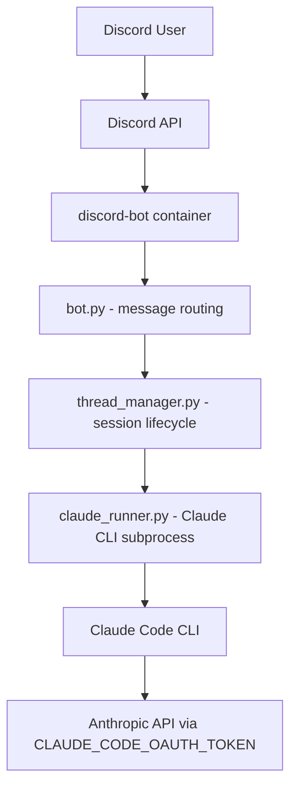

# Game Runtime System — Technical Specification

**Version**: 1.0  
**Date**: 2026-09-02  
**Status**: Point-in-time snapshot of runtime system as implemented in archon_core

---

## Overview

This document provides a comprehensive, standalone technical specification for the **game runtime system** — the Discord bot that runs tabletop RPG (D&D) sessions via Claude Code. The spec is thorough enough that someone could recreate the runtime system from scratch in a new repository without needing to reverse-engineer the archon_core codebase.

The game runtime is architecturally distinct from the Archon orchestrator. While it currently lives inside the archon_core repository, it has clear boundaries and can be extracted into its own project for independent deployment, development, and scaling.

**Purpose**: Provide a complete blueprint for splitting the game runtime into its own project.

**Scope**: This specification documents the runtime system as it exists today. It does NOT cover:
- Archon orchestrator internals (only interfaces/contracts)
- Migration plan for project split (separate issue)
- Future features or desired state (current behavior only)
- The dnd-viewer web UI replacement (separate repo: Thummpy/dnd-viewer)

---

## Table of Contents

1. [Core Runtime Architecture](#1-core-runtime-architecture)
2. [Model Configuration](#2-model-configuration)
3. [Discord Integration](#3-discord-integration)
4. [Context Management](#4-context-management)
5. [Session Data & Persistence](#5-session-data--persistence)
6. [Customizations & Modifications](#6-customizations--modifications)
7. [File & Directory Layout](#7-file--directory-layout)
8. [Deployment](#8-deployment)
9. [Archon Boundary](#9-archon-boundary)

---

## 1. Core Runtime Architecture

### Component Interaction



### Session Lifecycle

The runtime manages three distinct phases for each D&D session:

#### 1. Creation Phase

**Source**: `bot.py:277-294`

When a user posts in a mapped channel (not already in a thread):

1. `_ensure_thread()` creates a Discord thread named `"Claude — {first 50 chars}"` with 24-hour auto-archive
2. `thread_manager.get_or_create_session_id()` generates a UUID v4
3. Thread context is initialized in `/data/threads/{thread_id}.json`

#### 2. Resumption Phase

**Source**: `bot.py:297-455`

On subsequent messages in an existing thread:

1. `thread_manager.load_context()` reads `{thread_id}.json` from `/data/threads/`
2. If `session_id` exists:
   - `claude_runner.run_claude()` is called with `--resume {session_id}`
3. If no `session_id` (old thread from before session persistence):
   - A new session_id is generated
   - `is_new_session=True` triggers `--session-id {id}` instead of `--resume`

#### 3. Termination Phase

**Source**: `bot.py:334-353`, `config.py:39`

When `message_count >= ARCHIVE_THRESHOLD` (4000 messages):

1. Thread is automatically archived
2. User is notified to start a new thread
3. Thread context JSON remains on disk for historical reference

**Migration note**: The entrypoint script (`discord-bot-entrypoint.sh:42-51`) contains a one-time migration that creates a fresh thread JSON for a specific thread that hit an earlier 500-message threshold.

### Process Management

**Source**: `claude_runner.py:109-232`

Claude CLI processes are managed via Python's asyncio subprocess API:

- **Spawning**: `asyncio.create_subprocess_exec` with `stdout=PIPE`, `stderr=PIPE`
- **Environment**: Subprocess inherits environment with:
  - `CLAUDE_CODE_OAUTH_TOKEN`: Authentication for Anthropic API
  - `CLAUDE_CODE_AUTO_COMPACT_WINDOW=900000`: Auto-compact context at 900K tokens
- **Timeout**: `asyncio.wait_for` with `CLAUDE_TIMEOUT_SECONDS` (600s, configured in `config.py:41`)
- **Timeout handling**: `proc.kill()` + `await proc.wait()` + raise `TimeoutError`
- **Concurrency control**: Per-thread `asyncio.Lock` in `bot.py:36,42-45`
  - **Rule**: One Claude process per Discord thread at a time
  - **Why**: Prevents race conditions on session JSONL files

### CLI Command Construction

**Source**: `claude_runner.py:135-146`

The runtime constructs Claude CLI commands based on session state:

**Base command**:
```bash
claude -p {prompt} --output-format json --model claude-opus-4-6[1m]
```

**New session** (first message in thread):
```bash
claude --session-id {uuid} -p {prompt} --output-format json --model claude-opus-4-6[1m]
```

**Resume session** (subsequent messages):
```bash
claude --resume {uuid} -p {prompt} --output-format json --model claude-opus-4-6[1m]
```

**No session** (slash commands):
```bash
claude -p {prompt} --output-format json --model claude-opus-4-6[1m]
```

**Working directory**: Set to project directory for the channel (e.g., `/data/projects/Thummpy/dnd-context/source`)

### Response Parsing

**Source**: `claude_runner.py:213-232`, `bot.py:161-179`

The runtime handles multiple JSON response formats from Claude CLI:

1. **Result-object format**: `{"result": "text", "is_error": bool}` → extract `result` field
2. **Multi-block array**: `[{"type": "text", "text": "..."}, ...]` → join text blocks with `\n\n`
3. **Fallback**: If JSON parse fails, use raw stdout text

**Discord message chunking**:
- Discord limit: 2000 characters per message
- Split at newline boundaries via `rfind("\n", 0, limit)`
- Hard split at limit if no newline found in chunk
- Leading newlines stripped between chunks

### Health Monitoring

**Source**: `healthcheck.py:1-20`, `bot.py:38,55-60`, `docker-compose.yml:88-93`

The runtime implements a sentinel-file health check:

- **Sentinel file**: `/data/bot_healthy`
- **Update triggers**: Touched on `on_ready` event and after each successful message
- **Health check command**: `python3 /app/healthcheck.py`
- **Health criteria**: Sentinel file must exist and be < 120 seconds old
- **Docker healthcheck**:
  - Interval: 30s
  - Timeout: 10s
  - Retries: 3
  - Start period: 15s

---

## 2. Model Configuration

### Current Model Assignment

**Source**: `claude_runner.py:135`, `memories/reference_model_ids.md`

| Use Case | Model ID | Context Window | Notes |
|----------|----------|----------------|-------|
| D&D game engine (discord-bot) | `claude-opus-4-6[1m]` | 1M tokens | **DISCREPANCY**: Code uses `opus-4-6[1m]` but memory indicates intended model is `claude-fable-5[1m]` |
| Planning/review | `claude-opus-4-6[1m]` | 1M tokens | Used in Archon workflows |
| Implementation | `claude-sonnet-4-5-20250929[1m]` | 1M tokens | Used in Archon workflows |
| Cheap classification | `haiku` | Default | Light tasks |

**⚠️ CRITICAL NOTE**: The source code at `claude_runner.py:135` currently hardcodes `claude-opus-4-6[1m]`. The memory file `reference_model_ids.md` indicates the game engine model should be `claude-fable-5[1m]`. This spec documents both the current implementation and the intended configuration.

### Models to AVOID

**Do not use**:
- `sonnet` — resolves to Sonnet 4.6, which may overreach for the game engine use case
- `opus` — ambiguous, may resolve to 4.7
- `opus[1m]` — same risk as `opus`

Always use explicit model IDs with context window suffix (e.g., `[1m]`).

### Thinking and Steering Configuration

**Source**: `claude_runner.py:11-48`, `memories/reference_thinking_steering.md`

**Problem**: Opus 4.6 ignores thinking configuration flags (`--thinking enabled`, `--thinking-budget high/max`) when running against a long no-thinking roleplay history. Config levers are ineffective.

**Solution**: Per-message OOC (out-of-character) steering. This is the ONLY approach that works reliably.

**Three steering modes**:

| Mode | OOC Instruction | Effect |
|------|-----------------|--------|
| `adult` | "Do NOT think before responding" + explicit psychology/agency instructions | Zero thinking even with steering — thinking-on-adult is unreachable |
| `combat` | "Think hard before responding" + tactical pass | Forces extended thinking for combat encounters |
| `social` | "Think hard before responding" + psychology pass (default) | Forces extended thinking for social/RP encounters |

**How OOC steering works**:

1. `_detect_style_declaration()` checks first 160 chars for `{user_style_<mode>}` tag
2. If detected AND `project_dir` exists, reads `{project_dir}/rules/user_style_{mode}.md`
3. Injects content wrapped in sentinels: `{style_injection: user_style_X.md}...{/style_injection}`
4. Mode latches per session in `/data/style_modes.json` — untagged turns keep current register
5. Mode-matched OOC line appended LAST (below injection)

**Auto-compact**: Set to 900,000 tokens via `CLAUDE_CODE_AUTO_COMPACT_WINDOW` environment variable (`claude_runner.py:131`).

---

## 3. Discord Integration

### Bot Setup

**Source**: `bot.py:29-34`, `requirements.txt`

- **Library**: py-cord 2.6.1
- **Intents**: `message_content`, `guilds`, `messages`
- **Single server**: `DISCORD_SERVER_ID` environment variable (default: `1509185927505907715`)

### Channel-to-Session Mapping

**Source**: `config.py:35-37`

The runtime maps Discord channel names to project subdirectories:

```python
CHANNEL_MAP = {
    "dnd-context": "Thummpy/dnd-context/source",
}
```

**Mapping logic**:
- Channel name (e.g., `"dnd-context"`) → project subdirectory under `/data/projects/`
- Full path: `/data/projects/Thummpy/dnd-context/source`
- Only messages in mapped channels are processed (`bot.py:201`)
- Thread messages use parent channel name for mapping (`bot.py:196-199`)

**⚠️ LIMITATION**: Channel map is hardcoded in `config.py`. Multi-campaign support requires code changes.

### Message Flow

**Source**: `bot.py:188-274`

The bot processes messages through this flow:

1. **`on_message` event**:
   - Filter: Skip bot's own messages
   - Filter: Check channel mapping (unmapped channels ignored)

2. **`_ensure_thread()`**:
   - If message is in a channel (not already a thread), create thread

3. **`_handle_thread_message()`**:
   - Acquire per-thread lock (prevent concurrent Claude processes)
   - Load thread context from `/data/threads/{thread_id}.json`
   - Check session existence
   - Check archive threshold (4000 messages)
   - Call `claude_runner.run_claude()` with appropriate flags
   - Save updated context
   - Send response chunks to Discord

### Slash Commands

**Source**: `bot.py:63-158`

The runtime supports filesystem-driven slash commands:

- **Command loading**: All `.md` files in `COMMANDS_DIR` (`/.claude/commands` by default)
- **Command naming**: Filename becomes command name (e.g., `event-design.md` → `/event-design`)
- **Command execution**:
  - Content prepended to user args: `/{cmd_name} {args}\n\n---\n\n{file_content}`
  - Run as one-off prompts (no session persistence)
- **Registration**: Registered as guild-specific commands via `bot.command(guild_ids=[DISCORD_SERVER_ID])`

### Message Chunking

**Source**: `bot.py:161-179`

Discord messages have a 2000-character limit. The runtime handles this via smart chunking:

1. Find last newline within 2000 chars: `rfind("\n", 0, limit)`
2. If newline found, split there
3. If no newline, hard split at 2000 chars
4. Strip leading newlines between chunks
5. Send each chunk as separate Discord message

### Permission Model

**Source**: `bot.py:206-274`

**Required Discord permissions**:
- Create Public Threads
- Send Messages in Threads
- Read Message History
- Use Slash Commands

**Error handling**:
- Graceful handling for `discord.Forbidden`, `discord.HTTPException`
- User-facing error messages for permission, API, and I/O errors

---

## 4. Context Management

### Pre-Resume Context Stripping

**Source**: `memories/project_context_management_architecture.md`

**⚠️ NOTE**: `strip_session.py` lives in the dnd-context project, NOT in archon_core. It is a dependency on the project repository.

- Runs pre-resume on the bot side (before `claude --resume`), NOT as a Claude instruction
- Provides zero-lag clean context (no model processing delay)
- **Preserves thinking blocks** (updated 2026-06-24)
- **Strips old style injection spans** from user records in session JSONL

### Bash vs Read Tool Split

**Source**: `memories/project_context_management_architecture.md`

The runtime uses two distinct approaches for loading context:

#### Use Bash (cat) for re-read-each-turn items:

- **Style files**:
  - `user_style_social.md` (~2k chars)
  - `user_style_combat.md` (~1.5k chars)
  - `user_style_adult.md` (~12k chars)
- **DM state files**: `dm_event`, `dm_scene`
- **Combat state** (file-driven, not session-driven)

**Why Bash**: Strip-session cleaning prevents accumulation. These files change frequently and need fresh reads.

#### Use Read tool for load-once items:

- **Character profiles**
- **Party assets**
- **Atlas files** (world/location data)

**Why Read**: Persist through strip, not re-read. These files are large and stable.

### Style Injection

**Source**: `claude_runner.py:77-106`

The runtime implements sophisticated style steering:

1. **Detection**: `_detect_style_declaration()` checks first 160 chars of prompt for `{user_style_<mode>}` tag
2. **File loading**: If tag detected AND `project_dir` exists, reads `{project_dir}/rules/user_style_{mode}.md`
3. **Injection**: Content wrapped in sentinels for later removal:
   ```
   {style_injection: user_style_X.md}
   [style file content]
   {/style_injection}
   ```
4. **Mode latching**: Mode persists per session in `/data/style_modes.json`
5. **Untagged turns**: Keep current mode register (no re-detection)
6. **OOC line**: Mode-matched OOC instruction appended LAST (below style injection)

### Combat State

**Source**: `memories/project_context_management_architecture.md`

Combat state is **file-driven, not session-driven**:

- Lives in a temp file with init-ordered tables, NPC profile copies, append-only log
- Round state updates in-place
- Log section captures error rollback data
- Persists until next `roll-init` command
- Does NOT interact with strip-session (separate lifecycle)

### CLAUDE.md and Project Instructions

**Source**: Implicit from Claude Code behavior

- Loaded natively by Claude Code when `cwd` is set to the project directory
- `.claude/CLAUDE.md` in the project contains:
  - DM adjudication rules
  - Campaign-agnostic design principles
  - Session management instructions
- `.claude/commands/event-design.md` contains the event design workflow

---

## 5. Session Data & Persistence

### Thread Context Files

**Source**: `thread_manager.py`

Managed by the Discord bot for mapping threads to Claude sessions:

**Location**: `/data/threads/{thread_id}.json`

**Format**:
```json
{
  "thread_id": 1513311497135325385,
  "session_id": "6625e132-6394-42dd-8b83-4a099d9d5902",
  "updated_at": 1719432000.0,
  "message_count": 42,
  "messages": [
    {"role": "user", "content": "..."},
    {"role": "assistant", "content": "...", "trace": [...]}
  ]
}
```

**Write mechanism**: Atomic writes via `aiofiles` (async file I/O)

**Migration note**: `session_id` may be `null` for old threads (pre-session-persistence migration)

### Claude Code Session Files (JSONL)

**Source**: Implicit from Claude Code behavior

**Location**: `/home/botuser/.claude/projects/-data-projects-Thummpy-dnd-context-source/`
- Path derived from `cwd` used in `claude_runner.run_claude()`

**Format**: One JSON object per line (Claude Code's internal session format)

**⚠️ CRITICAL**: These JSONL files are the **golden record** — the authoritative game state.

### Golden Record Protocol

**Source**: `memories/feedback_golden_record_protocol.md`

Session JSONLs and campaign episode JSONs are **NEVER edited** without explicit show-plan-and-confirm cycle.

**Before ANY edit**:

1. Output exact division/edit points with line numbers
2. Show proposed content deltas
3. Provide byte-level before/after estimate
4. Indicate which lines are touched vs preserved
5. **STOP and wait for "go"** from user

**Why**: Session JSONL corruption can destroy campaign state. Edits require extreme care.

### Rewind Operation

**Source**: `memories/reference_rewind_operation.md`

The rewind operation allows truncating session state to a prior point:

**Procedure**:

1. User says "rewind" with quoted snippet from session to rewind to
2. **Search only tail**: `tail -100 | grep` — target is ALWAYS near end
3. First matching line is usually `queue-operation enqueue` — cut there
4. Truncate: `head -n <line-1> file > tmp && mv tmp file`
5. **⚠️ CRITICAL**: `chmod 666` after `mv`
   - **Why**: Discord bot runs as `bun` (uid 1000), Archon as `appuser` (1001)
   - Default umask makes file 644, bot's `--resume` fails with EACCES
6. Verify tail line is a mode/last-prompt record
7. **⚠️ RACE HAZARD**: If bot has in-flight turn, truncating via head+mv replaces inode mid-write
   - **Check before rewind**: `bot.log` tail — last "Spawning claude subprocess" must have matching "subprocess finished"

### Distiller Output Contract

**Source**: `memories/feedback_distiller_output.md`

The distiller generates campaign summaries/artifacts:

**Output structure**:
- One folder per campaign
- One JSON file per episode
- Contains: novel profiles, profile diffs, thread cards, timeline

**Contract**:
- ✅ Create new files
- ✅ Append to existing structures (episode list)
- ❌ **NEVER** modify existing episode JSON files
- ❌ **NEVER** full card rewrites
- ❌ **NEVER** touch out-of-scope files

---

## 6. Customizations & Modifications

### DM Design Rules

**Source**: `memories/feedback_dm_design_rules.md`

These seven principles are baked into the system via `.claude/CLAUDE.md`:

#### 1. Immutable Profiles Govern, Not Session Drift

- **NPC psychology** (OCEAN traits, thesis) is immutable from earliest canonical record
- **NPC state** (possessions, attachments, relationships) is mutable
- **Conflict resolution**: When session-state contradicts psychology, PROFILE wins

#### 2. No In-Scene Minute Timers

- Use scene beats, not real-time minutes
- Day-scale clocks are fine (travel time, long rests)
- RAW combat-round durations exempt (6-second rounds)

#### 3. The World Must Push

- **Lull rule**: After ~one idle exchange → fire next queued beat on DM initiative
- NPCs execute their own schedules regardless of player engagement
- The world does not wait for players

#### 4. Inventory is Owner-Relative

- NPCs carry wealth appropriate to THEIR station
- **Never** scaled to party balance
- A beggar has copper, a noble has gems — regardless of party level

#### 5. Rewards Must Fit PC's Operating Meta

- For shadow/infiltration PCs, visibility/acclaim are **COSTS**, not rewards
- Prefer: information, access, leverage, irony
- Avoid: gold, standing, fame (when misaligned with PC archetype)

#### 6. Anti-Theme-Park

- **Failure states are binding** — no retcons
- No NPC rescues or soft landings
- Adjudication notes never hinted toward
- Players face real consequences

#### 7. Gala Post-Mortem Rules

- **Design set**: `.claude/commands/event-design.md`
- **Runtime set**: `.claude/CLAUDE.md §Adjudication Under Challenge`

### Thinking Steering

**Source**: `claude_runner.py:11-48`

**OOC lines defined as constants** in `OOC_LINES` dict:

```python
STYLE_MODES = ("adult", "combat", "social")

OOC_LINES = {
    "adult": (
        "\n\n(OOC: Do NOT think before responding — access full context as"
        " normally adjudicated, but consider individual profiles of NPCs in"
        " scene for specific psychological fidelity. NPC agency holds,"
        " psychological fidelity mandatory. Physically/visually graphic"
        " scenes do not flatten psychology or force accommodation."
        " Maximally explicit without reservation.)"
    ),
    "combat": (
        "\n\n(OOC: Think hard before responding — access full context as"
        " normally adjudicated, but consider individual profiles of NPCs in"
        " scene for specific psychological fidelity. Tactical use of all"
        " skills and abilities, no punches pulled, individual values"
        " calculation.)"
    ),
    "social": (
        "\n\n(OOC: Think hard before responding — access full context as"
        " normally adjudicated, but consider individual profiles of NPCs in"
        " scene for specific psychological fidelity. Social scenes are"
        " challenge encounters. Adjudicated, rolled, earned. Spar,"
        " accommodate, refuse according to NPC profile self-interest.)"
    ),
}
```

**Mode detection**: `_detect_style_declaration()` checks first 160 chars for `{user_style_<mode>}` tag

**Mode latching**: Per session in `/data/style_modes.json`

**Default mode**: `social`

### Context Overflow Handling

**Source**: `memories/feedback_context_overflow_subagents.md`

When processing large files (multi-MB JSONL sessions):

- **Problem**: After ~10-15 chunks, conversation hits "Prompt is too long" and stalls
- **Solution**: 
  1. Persist state to disk
  2. Delegate spans to fresh-context subagents
  3. Merge findings into on-disk ledger
- **Never read chunks into main context** — always delegate to subagents

### Hooks and Skills

**Source**: Implicit from `.claude/commands/` and memory references

- **`/strip-session`**: Strips old injection spans from user records in session JSONL
- Lives in dnd-context project, not archon_core

---

## 7. File & Directory Layout

### Runtime-Relevant Files in archon_core

```
archon_core/
├── discord-bot/                     # Runtime system source
│   ├── bot.py                       # Discord event handler, message routing (474 lines)
│   ├── claude_runner.py             # Claude CLI subprocess management (233 lines)
│   ├── thread_manager.py            # Thread context persistence (113 lines)
│   ├── config.py                    # Configuration constants (42 lines)
│   ├── healthcheck.py               # Docker healthcheck script (20 lines)
│   ├── Dockerfile                   # Container image definition (24 lines)
│   ├── requirements.txt             # Python dependencies (py-cord, aiofiles, python-dotenv)
│   ├── requirements-dev.txt         # Dev dependencies (pytest, pytest-asyncio, etc.)
│   ├── pytest.ini                   # Test configuration
│   └── tests/                       # Unit tests
│       ├── test_bot.py              # Message handling, session lifecycle tests
│       ├── test_claude_runner.py    # CLI construction, response parsing tests
│       └── test_thread_manager.py   # Context persistence, session ID tests
├── scripts/
│   └── discord-bot-entrypoint.sh    # Container entrypoint (token validation, permissions, 61 lines)
├── docker-compose.yml               # discord-bot service definition (lines 65-95)
├── .env.example                     # Environment variable template (47 lines)
└── .github/workflows/deploy.yml     # CI/CD deployment (permission fixes, 146 lines)
```

### Runtime Data on Host (Persistent Volumes)

```
~/archon-data/
├── discord-bot/                     # Mounted as /data in container
│   ├── threads/                     # Thread context JSON files
│   │   └── {thread_id}.json         # Per-thread message history + session_id
│   ├── logs/
│   │   └── bot.log                  # Rotating log (5MB max, 3 backups)
│   ├── style_modes.json             # Latched style modes per session
│   └── bot_healthy                  # Health sentinel file
├── claude-home/                     # Mounted as /home/botuser/.claude
│   ├── projects/                    # Claude Code session data
│   │   └── -data-projects-Thummpy-dnd-context-source/
│   │       └── {session-uuid}.jsonl # Session JSONL files (GOLDEN RECORDS)
│   ├── .claude.json                 # Claude Code config
│   └── backups/                     # .claude.json backups
├── commands/                        # Mounted as /.claude/commands (read-only)
│   └── *.md                         # Slash command definitions
└── workspaces/                      # Mounted as /data/projects
    └── Thummpy/dnd-context/source/  # Game project clone
        ├── .claude/
        │   ├── CLAUDE.md            # DM rules, adjudication instructions
        │   └── commands/
        │       └── event-design.md  # Event design workflow
        └── rules/
            ├── user_style_social.md # Social mode style (~2k chars)
            ├── user_style_combat.md # Combat mode style (~1.5k chars)
            └── user_style_adult.md  # Adult mode style (~12k chars)
```

### Archon-Specific Files (NOT Part of Runtime)

**These files live in archon_core but are NOT needed for standalone runtime**:

- `docker-compose.yml` services: `app`, `oauth2-proxy`, `caddy` (only `discord-bot` service is runtime)
- `scripts/` (all except `discord-bot-entrypoint.sh`): backup, sync, OAuth, upgrade, Terraform
- `terraform/` — GCP infrastructure for Archon
- `docs/` — Archon operational documentation (except this spec)
- `memories/` — Claude Code memory files (used by Archon sessions)
- `.archon/` — Archon workflow definitions and config

---

## 8. Deployment

### Current Deployment Model

**Platform**: GCP Compute Engine VM  
**Container runtime**: Docker Compose  
**Image**: Custom-built from `discord-bot/Dockerfile`  
**Base image**: `python:3.12-slim-bullseye`  
**Runtime dependencies**: Node.js 20 (for Claude CLI), Python 3.12

### Docker Compose Service

**Source**: `docker-compose.yml:65-95`

```yaml
discord-bot:
  init: true
  build:
    context: ./discord-bot
  container_name: archon-discord-bot
  env_file: .env
  environment:
    DISCORD_BOT_TOKEN: "${DISCORD_BOT_TOKEN:-}"
    DISCORD_SERVER_ID: "${DISCORD_SERVER_ID:-1509185927505907715}"
    CLAUDE_CODE_OAUTH_TOKEN: "${CLAUDE_CODE_OAUTH_TOKEN}"
    ARCHON_DOCKER: "true"
  volumes:
    - ./discord-bot:/app:ro
    - ./scripts/discord-bot-entrypoint.sh:/entrypoint.sh:ro
    - ${HOME}/archon-data/commands:/.claude/commands:ro
    - ${HOME}/archon-data/discord-bot:/data
    - ${HOME}/archon-data/claude-home:/home/botuser/.claude
    - ${HOME}/archon-data/workspaces:/data/projects
  entrypoint: ["/bin/bash", "/entrypoint.sh"]
  restart: unless-stopped
  healthcheck:
    test: ["CMD-SHELL", "python3 /app/healthcheck.py || exit 1"]
    interval: 30s
    timeout: 10s
    retries: 3
    start_period: 15s
  depends_on:
    - app
```

### Environment Variables

**Source**: `.env.example`

| Variable | Required | Description |
|----------|----------|-------------|
| `DISCORD_BOT_TOKEN` | Yes | Discord bot credentials from Discord Developer Portal |
| `CLAUDE_CODE_OAUTH_TOKEN` | Yes | Anthropic API access via Claude Code Max subscription |
| `DISCORD_SERVER_ID` | No | Discord server ID (defaults to `1509185927505907715`) |
| `ARCHON_DOCKER` | Set by compose | Signals running in Docker environment |

### Shared Volume: `.claude/`

**Source**: `memories/project_discord_shared_perms.md`, `.github/workflows/deploy.yml:84`

**Volume**: `${HOME}/archon-data/claude-home`

**Mount points**:
- `/home/appuser/.claude` in `app` container (Archon)
- `/home/botuser/.claude` in `discord-bot` container

**Why shared**: BOTH containers need read/write access to session data (JSONL files, project configs)

**Permission setup**:
- Deploy sets `chmod -R 777` on `claude-home` (`.github/workflows/deploy.yml:84`)
- Entrypoint sets `umask 0000` so new files are world-readable (`discord-bot-entrypoint.sh:36`)
- **User IDs**: `botuser=1000`, `appuser=1001` — mismatch requires permissive permissions

### Container User Setup

**Source**: `Dockerfile:14-15`

```dockerfile
RUN groupadd -g 1000 botuser && useradd -u 1000 -g botuser -m botuser
RUN mkdir -p /home/botuser/.claude /data/threads /data/projects && chown -R botuser:botuser /data
```

### For Standalone Deployment

**Changes needed to run runtime independently**:

1. **Remove `depends_on: app`** — No Archon dependency
2. **Source `.claude/commands/`** from runtime project instead of Archon data
3. **Source `workspaces/`** from direct project clone instead of Archon workspace
4. **Replace Archon-managed OAuth token** with direct `claude setup-token` on runtime host
5. **Keep `claude-home` volume mount** for Claude CLI session persistence
6. **Provide own CI/CD** (currently handled by archon_core's `deploy.yml`)

### GCP Specifics

**Source**: `memories/reference_gcp_project.md`

- **Project**: `dev-services-497603`
- **Secrets**: 
  - `archon-chris-discord-bot-token`
  - `archon-chris-claude-oauth-token`
  - Stored in GCP Secret Manager
- **SSH**: Terraform-managed keys extracted at deploy time

---

## 9. Archon Boundary

### Interfaces/Contracts Between Runtime and Archon

The runtime system has minimal coupling to Archon. Here are the explicit dependencies:

#### 1. Shared `.claude/` Volume

**The only hard dependency.**

- Both containers read/write Claude Code session data
- **For standalone**: Runtime owns this volume outright — no sharing needed

#### 2. Commands Directory

**Source**: `${HOME}/archon-data/commands:/.claude/commands:ro`

- Archon manages command definitions in current setup
- **For standalone**: Runtime carries its own commands (copy `.md` files to runtime repo)

#### 3. Workspaces Directory

**Source**: `${HOME}/archon-data/workspaces:/data/projects`

- Archon clones project repos here in current setup
- **For standalone**: Runtime manages its own project clones

#### 4. `depends_on: app` in Docker Compose

- Startup ordering dependency
- **For standalone**: Remove entirely — no Archon app container

#### 5. Deploy Workflow

**Source**: `.github/workflows/deploy.yml`

- Deploys ALL services (Archon + discord-bot)
- **For standalone**: Create separate deploy pipeline for runtime only

### No Runtime Dependencies on Archon App Container

**⚠️ CRITICAL**: The discord-bot **NEVER** calls Archon's API.

- Reads from shared filesystem only (`.claude/` volume)
- No SDK coupling
- No RPC coupling
- No API coupling

The runtime is architecturally independent and can be extracted cleanly.

---

## Appendix: Related Projects

### dnd-viewer

**Repository**: `Thummpy/dnd-viewer`

The dnd-viewer project is being developed as a **web UI replacement** for the Discord frontend. It uses the same `claude --resume` pattern and needs the same `claude-home` volume.

**Relationship to runtime**:
- Parallel consumer of the same runtime architecture
- NOT covered by this spec (separate project)
- Shares session data format and Claude Code integration patterns

---

## Document History

| Version | Date | Changes |
|---------|------|---------|
| 1.0 | 2026-09-02 | Initial specification — point-in-time snapshot of archon_core runtime system |

**Maintenance note**: This spec documents the runtime system as it exists on 2026-09-02. As the codebase evolves, this document may become stale. Treat it as a point-in-time blueprint for project extraction, not living documentation.
